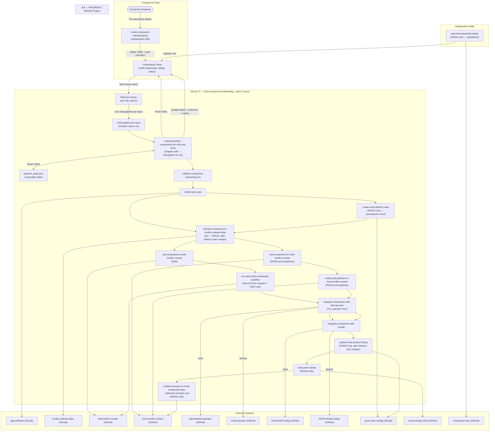

# Component Onboarding Automation

## Overview

The ODH/RHOAI component onboarding workflow is implemented as a **suite of modular Claude Code skills**, each responsible for one discrete step of the pipeline. A component team member first runs the `create-component-onboarding-jira` skill to create the Jira ticket and capture onboarding parameters. From there, the process is **fully automated** — a GitLab CI pipeline in this project runs every two hours, discovers all eligible open Jira issues, and triggers the `onboard-konflux-components-for-odh-and-rhoai` wrapper skill for each one via Claude Code running in CI.

Each CI run is **short-lived and non-blocking**: the wrapper checks what has merged since the last run, raises PRs/MRs for any newly-unblocked steps, posts a Jira update, and exits immediately — it never waits for reviews or merges. The scheduler provides the polling cadence; the job itself completes in minutes. The ticket transitions to "Resolved" automatically once all PRs and MRs are merged and detected on a subsequent run.

The skill supports both **ODH** and **RHOAI** onboarding from a single invocation. ODH and RHOAI share a common core pipeline (Steps 1–8) but diverge on product-specific steps: for RHOAI, `create-rhoai-delivery-repo` runs early (before `onboard-component-to-konflux-release-data`) and additional steps handle product listing, auto-merge, and Renovate enablement; for ODH, a deferred GitHub Actions workflow is triggered once both `krd` and `okc` are merged. The skill is **fully idempotent**: re-running it any number of times for the same Jira issue is safe — completed steps are always skipped, already-raised PRs/MRs are never duplicated, and state is restored from Jira labels if the local file is absent.

---

## Architecture Diagram



---

## Entry Points and Independent Skills

### 1. `create-component-onboarding-jira` — Run by Component Teams

This skill is **independent** and intended for component teams, not DevOps. It:

1. Interactively collects onboarding parameters via a guided Q&A (product context, component name, repo URL, branch, Dockerfile path, CPU architectures, release category, descriptions, whether it is an operator, etc.).
2. For RHOAI, auto-fetches the repo README to suggest `long_description` and `short_description`.
3. For RHOAI, validates that the Dockerfile pins all `FROM` images with `@sha256` digests.
4. Generates a validated `component_onboarding_details.yaml` against a JSON Schema.
5. When no Jira URL is provided, automatically clones the product-specific onboarding template (ODH: `RHOAIENG-35683`, RHOAI: `RHOAIENG-17225`) and creates a new ticket.
6. Attaches the YAML to the Jira ticket, sets the `yaml-attached` label, and links the parent feature.

```
/create-component-onboarding-jira [<jira-url>]
```

| Invocation | ODH | RHOAI |
|---|---|---|
| No URL | Clones `RHOAIENG-35683`, creates ticket, attaches YAML | Clones `RHOAIENG-17225`, creates ticket, attaches YAML |
| With URL | Attaches YAML to existing ticket | Attaches YAML to existing ticket |

The YAML attachment is the **contract** between the component team and the automation. Once attached and the Jira label `yaml-attached` is set, the ticket is picked up automatically on the next CI run.

#### YAML Schema (`component_onboarding_details.yaml`)

All fields live under an `inputs:` top-level key. Required fields:

| Field | Type | ODH | RHOAI | Notes |
|-------|------|-----|-------|-------|
| `product_context` | string | ✓ | ✓ | `ODH` or `RHOAI` |
| `component_name` | string | ✓ | ✓ | Must match `^odh-[a-z0-9]+(-[a-z0-9]+)*$` |
| `repo_url` | string | ✓ | ✓ | `https://github.com/...` |
| `repo_branch` | string | ✓ | ✓ | RHOAI: auto-derived from `target_rhoai_version` |
| `context_path` | string | ✓ | ✓ | Docker build context (use `./` for root) |
| `dockerfile_path` | string | ✓ | ✓ | RHOAI: filename must contain `Dockerfile.konflux` |
| `is_operator` | boolean | ✓ | ✓ | Controls operator-specific steps |
| `build_type` | string | ✓ | — | `CI` or `Release` |
| `target_rhoai_version` | string | — | ✓ | Canonical form: `x.y` or `x.y-ea-N` |
| `architectures` | string[] | — | ✓ | `x86_64`, `arm64`, `ppc64le`, `s390x`; default `[x86_64, arm64]` |
| `release_category` | string | — | ✓ | `Generally Available`, `Tech Preview`, or `Beta` |
| `short_description` | string | — | ✓ | A short noun phrase summarising the component |
| `long_description` | string | — | ✓ | One–two sentences describing what the component does |
| `operator_manifest_src_path` | string | if operator | if operator | Relative path to manifests in git repo |
| `operator_manifest_dest_path` | string | if operator | if operator | Destination path in odh-operator image |

### 2. `add-rhoai-dockerfile-labels` — Independent Skill (RHOAI only)

This skill is **independent** of the main onboarding pipeline. It checks a component's Dockerfile for the 7 mandatory RHOAI OCI labels and raises a PR to add any that are missing or incorrect. It can be run standalone or from the master orchestrator.

```
/add-rhoai-dockerfile-labels [<jira-url>]
```

**Mandatory labels:** `name`, `com.redhat.component`, `summary`, `description`, `maintainer`, `io.k8s.display-name`, `io.k8s.description`.

Workflow:
1. Reads `component_onboarding_details.yaml` from Jira (or from pipeline state).
2. Fetches the Dockerfile via the GitHub API and checks all 7 labels.
3. If all labels are correct, exits cleanly with a `dockerfile-labels-present` Jira label.
4. If any are missing or wrong, clones the repo, adds them via `update_dockerfile_labels.py`, and raises a PR.
5. Updates Jira with `dockerfile-labels-pr-raised` label and a comment with the PR URL.

### 3. `onboard-konflux-components-for-odh-and-rhoai` — Run by GitLab CI

This is the **wrapper / parent skill** that drives the full onboarding pipeline. It runs automatically in CI every two hours (or can be triggered manually via the GitLab UI). For each eligible Jira issue the CI pipeline:

1. Validates prerequisites and reads the YAML attachment from Jira.
2. Restores `pipeline_state.json` from Jira labels (works on a fresh CI checkout with no local state).
3. Derives `PRODUCT_CONTEXT` (ODH or RHOAI) and marks non-applicable steps as skipped.
4. Queries GitHub/GitLab APIs to detect any PRs/MRs that merged since the last run — skips steps already done.
5. Raises PRs/MRs for all newly-unblocked steps and records their URLs, then **exits immediately** — no waiting.
6. Posts a Jira comment only when something changed this run.
7. Transitions the ticket to "Resolved" automatically when all steps are detected as done.

---

## CI Pipeline Design

The GitLab CI pipeline in this project (`rhoai-component-onboarding`) runs on a scheduled trigger every two hours. It follows a **3-level cascade** where the parent pipeline dynamically generates and triggers a separate child pipeline for each eligible Jira issue.

### Pipeline Cascade

```
Parent pipeline (.gitlab-ci.yml)
│
├── Stage: generate
│   └── fetch-jira-issues
│       • Queries Jira via acli JQL
│       • Emits generated-child-pipelines.yml (artifact)
│         containing one trigger job per issue
│
└── Stage: trigger
    └── trigger-onboarding-pipelines
        • Passes generated-child-pipelines.yml as a child pipeline
        │
        └── Child pipeline (generated-child-pipelines.yml — one job per issue)
            │
            ├── trigger-RHOAIENG-NNNNN  ──► Grandchild pipeline (child-pipeline.yml)
            │                                └── onboard-component job
            │                                    runs Claude for RHOAIENG-NNNNN
            │
            ├── trigger-RHOAIENG-MMMMM  ──► Grandchild pipeline (child-pipeline.yml)
            │                                └── onboard-component job
            │                                    runs Claude for RHOAIENG-MMMMM
            ...
```

Each grandchild pipeline receives the `JIRA_URL` for its specific issue and runs independently in parallel. `child-pipeline.yml` is a static template committed to this repo; the generated child pipeline just passes a different `JIRA_URL` variable to each instance of it.

### Stage breakdown

| Level | Stage | Job | What it does |
|-------|-------|-----|--------------|
| Parent | `generate` | `fetch-jira-issues` | Queries Jira via `acli` JQL; generates `generated-child-pipelines.yml` with one trigger job per eligible issue |
| Parent | `trigger` | `trigger-onboarding-pipelines` | Passes the generated YAML as a GitLab child pipeline; waits for all grandchild pipelines to complete |
| Grandchild | `onboard` | `onboard-component` | Installs Claude and skills, then runs `onboard-konflux-components-for-odh-and-rhoai` with the issue's `JIRA_URL` |

### Issue selection JQL criteria

- Project: `RHOAIENG` (or `RHODS`)
- Status: not in any terminal state (Resolved, Closed, Done, Cancelled, etc.)
- Label: `component-onboarding`
- Cloned from: `RHOAIENG-17225` or `RHOAIENG-35683`

If no issues match, a no-op child pipeline is emitted and the run exits cleanly.

---

## End-to-End Flow

| Step | Skill | Action | Target Repo | ODH / RHOAI | HITL Gate |
|------|-------|--------|-------------|-------------|-----------|
| 0 | *(wrapper)* | Parse inputs, check prerequisites, derive product context, init/resume `pipeline_state.json`, sync state from Jira labels | — | Both | — |
| 1 | `validate-component-onboarding-jira` | Fetch YAML from Jira; validate against schema; set Jira → "In Progress" | — | Both | Blocks on schema failure |
| 2 | `create-quay-repo` | Raise GitLab MR to `app-interface` to create Quay repository | `gitlab.cee.redhat.com` | Both | MR review + merge |
| 3 | `create-rhoai-delivery-repo` | Raise GitLab MR to `pyxis-repo-configs` to provision the RHOAI delivery repository; **must merge before Step 4 is unblocked for RHOAI** | `gitlab.cee.redhat.com` | RHOAI only | MR review + merge |
| 4 | `onboard-component-to-konflux-release-data` | Render Konflux Component YAML; raise GitLab MR to `konflux-release-data`; run `build-single.sh`. For RHOAI: `depends_on delivery_repo` | `gitlab.cee.redhat.com` | Both | MR review + merge |
| 5 | `add-component-to-odh-konflux-central` / `add-component-to-rhoai-konflux-central` | Add push-pipeline Tekton PipelineRun YAMLs; raise GitHub PR to the product-specific konflux-central repo. ODH targets `main`; RHOAI targets a version-specific branch (e.g., `rhoai-3.4`) | `odh-konflux-central` / `rhoai-konflux-central` | Both (product-specific skill) | PR review + merge |
| 5b | `create-pull-pipelines-in-rhoai-konflux-central` | Add pull-request Tekton PipelineRun YAMLs; raise GitHub PR to `rhoai-konflux-central` (targets `main`, not version branch) | `rhoai-konflux-central` | RHOAI only | PR review + merge |
| 6 | `run-odh-konflux-onboarder-workflow` | *(Deferred, ODH only)* Once **both** Steps 4 and 5 are merged, triggers `odh-konflux-onboarder.yml` and monitors the resulting Tekton PR | `odh-konflux-central` | ODH only | Tekton PR review + merge |
| 7 | `integrate-component-with-odh-operator` | Skipped if `is_operator=false`. Raise GitHub PR to add manifest config to the product-specific operator repo | `opendatahub-operator` (ODH) / `rhods-operator` (RHOAI) | Both | PR review + merge |
| 8 | `integrate-component-with-bundle` | Add `relatedImages` entry to `bundle-patch.yaml`; (RHOAI only) also update `config/build-config.yaml` and `bundle/Dockerfile` with git label ARGs; raise GitHub PR. ODH targets `main`; RHOAI targets version-specific branch (e.g., `rhoai-2.16`) | `ODH-Build-Config` (ODH) / `RHOAI-Build-Config` (RHOAI) | Both | PR review + merge |
| 9 | `update-rhoai-product-listing` | Raise GitLab MR to `pyxis-repo-configs` to add the component to the RHOAI product listing; runs after Step 3 (`delivery_repo`) merges | `gitlab.cee.redhat.com` | RHOAI only | MR review + merge |
| 10 | `setup-auto-merge` | Raise GitHub PR to `rhods-devops-infra` to configure auto-merge for the component repo | `rhods-devops-infra` | RHOAI only | PR review + merge |
| 11 | `enable-renovate-on-rhoai-component-repo` | Raise GitHub PR to `rhoai-konflux-central` to enable Renovate; on merge, trigger deferred `sync-rhoai-renovate-configs` workflow | `rhoai-konflux-central` | RHOAI only | PR review + merge |

After all PRs/MRs are merged, Jira is transitioned to **Resolved** automatically on the next CI run.

---

## Execution Model

Each CI run is **idempotent and short-lived**. The wrapper never waits for PRs or MRs to be reviewed — it raises them and exits. The scheduler handles the polling: every two hours, the pipeline re-runs, detects what merged, and advances the next unblocked steps. Each individual run completes in minutes regardless of how many tickets are in flight.

A single run follows this pattern:

1. **Sync state** — `sync_state_from_jira.py` reconstructs `pipeline_state.json` from Jira labels; no local state file required.
2. **Check PR/MR status** — queries GitHub/GitLab APIs for every open PR/MR and records any that merged since the last run.
3. **Skip completed steps** — any step already `done`, `merged`, or `skipped` is never re-executed, even if the skill is invoked multiple times.
4. **Raise unblocked steps** — steps whose dependencies are now satisfied are executed: a PR/MR is raised and its URL recorded. The job then moves on immediately — no blocking wait.
5. **Post Jira comment** — a summary is posted only when something changed this run (new PRs raised or merges detected); silent runs produce no noise.
6. **Resolve or keep in Review** — all steps done → Jira transitions to Resolved with a full pipeline summary; otherwise stays in Review.

---

## State Management

The wrapper maintains `<JIRA_ID>/pipeline_state.json` in the CI working directory. Each step records its status (`pending` → `mr_raised` / `pr_raised` → `merged` / `skipped` / `done`) and the PR/MR URL. On each CI run, `sync_state_from_jira.py` restores state from Jira labels even if the local file is absent, ensuring clean resumption across independent CI job runs.

---

## Prerequisites

| # | Requirement | Details |
|---|-------------|---------|
| 1 | **GitLab CI variables** | `JIRA_USER_EMAIL`, `JIRA_API_TOKEN`, `GCP_PROJECT_ID`, `GCP_SERVICE_ACCOUNT_KEY` set in the GitLab project settings. |
| 2 | **Vertex AI / Claude Code** | Claude Code CLI runs in CI using Vertex AI (`CLAUDE_CODE_USE_VERTEX=1`). GCP service account must have Vertex AI access. |
| 3 | **Skills installed in CI** | `setup-skills.sh` clones `aiops-infra` and installs the skill suite into the CI container before invoking Claude. |
| 4 | **Jira ticket with YAML attached** | Component team must have run `create-component-onboarding-jira` first; the ticket must have the `yaml-attached` label. |
| 5 | **VPN / network access** | The CI runner must be able to reach `gitlab.cee.redhat.com` (Steps 2, 3, 4, 9). |
| 6 | **OpenShift tokens** | `EXT_OC_TOKEN` for the external cluster (stone-prd-rh01, ODH builds); `INT_OC_TOKEN` for the internal cluster (stone-prod-p02, RHOAI builds). Each is only required if no matching kubeconfig context is found for that cluster. |

---

## Jira Lifecycle

| Milestone | Jira Status | Labels |
|-----------|-------------|--------|
| YAML attached by component team | *(unchanged)* | `yaml-attached` added |
| CI picks up ticket, YAML validated | In Progress | — |
| All PRs/MRs raised | Review | `onboarding-in-review` added |
| Quay MR merged | Review | `quay-mr-raised` removed |
| Delivery repo MR raised *(RHOAI)* | Review | `delivery-repo-mr-raised` added |
| Delivery repo MR merged *(RHOAI)* | Review | `delivery-repo-mr-raised` removed, `delivery-repo-mr-merged` added |
| KRD MR merged | Review | `krd-mr-raised` removed |
| OKC/RKC PR merged | Review | `okc-pr-raised` / `rkc-pr-raised` removed |
| Pull pipelines PR raised *(RHOAI)* | Review | `rkc-pull-pr-raised` added |
| Pull pipelines PR merged *(RHOAI)* | Review | `rkc-pull-pr-raised` removed |
| ODH onboarder workflow triggered *(ODH)* | Review | `onboarder-workflow-triggered` added |
| Product listing MR merged *(RHOAI)* | Review | `product-listing-mr-raised` removed |
| Auto-merge PR merged *(RHOAI)* | Review | `auto-merge-pr-raised` removed |
| Renovate PR merged + sync triggered *(RHOAI)* | Review | `renovate-sync-triggered` added |
| Dockerfile labels correct *(RHOAI, independent)* | *(unchanged)* | `dockerfile-labels-present` added |
| Dockerfile labels PR raised *(RHOAI, independent)* | *(unchanged)* | `dockerfile-labels-pr-raised` added |
| All steps done | Resolved | `component-onboarding-completed` added, `onboarding-in-review` removed |

---

## Error Handling and Resumption

| Failure | Recovery |
|---------|----------|
| Missing CI variable or tool | Wrapper exits with a remediation message at Step 1. Fix the CI variable and re-trigger. |
| YAML schema validation fails | `validate-component-onboarding-jira` stops with specific errors. Component team fixes YAML, re-uploads to Jira; CI picks it up on the next run. |
| Network issue mid-run | GitLab calls fail; CI job exits non-zero. Completed steps are preserved in Jira labels; next run resumes from where it stopped. |
| MR/PR creation fails (3 retries) | CI job fails at that step. Check credentials and runner network access. Next scheduled run retries. |
| State file absent (fresh CI checkout) | `sync_state_from_jira.py` restores state from Jira labels and comments automatically. |
| Onboarder workflow 422 *(ODH)* | krd or okc not yet merged — next CI run retries after both merge. |
| Renovate sync workflow fails *(RHOAI)* | Re-run `/sync-rhoai-renovate-configs` manually after renovate PR merges. |
| Delivery repo already exists *(RHOAI)* | Child exits 0; step marked `done` with label `delivery-repo-exists`; krd unblocked immediately. |
| Dockerfile labels already correct *(RHOAI)* | `add-rhoai-dockerfile-labels` exits 0 with `dockerfile-labels-present` label; no PR needed. |
| Dockerfile labels PR fails 3× *(RHOAI)* | Check `GITHUB_TOKEN` push access to the component repo. Re-run skill manually. |

---

## Pros and Cons

**Pros**
- **Fully automated** — no DevOps engineer attention needed after the component team submits the Jira ticket.
- **Short-lived jobs** — each run completes in minutes; no long-running processes or blocking waits for PR reviews.
- **Truly idempotent** — safe to run any number of times; completed steps are skipped, no duplicate PRs/MRs are ever created.
- **Regular cadence** — runs every two hours, so onboarding advances promptly after each PR/MR is merged without manual intervention.
- **Modular and maintainable** — each onboarding step is a separate skill; changes to one step don't affect others.
- **Resumable from Jira** — state is always restorable from Jira labels; a fresh CI checkout with no local files never loses progress.
- **Jira as source of truth** — all progress, PR/MR links, and status transitions are recorded in Jira automatically.
- **ODH and RHOAI from one invocation** — product context is derived automatically; a single wrapper handles both pipelines.
- **Self-service Jira creation** — component teams can run `create-component-onboarding-jira` with no arguments and a ticket is created automatically from the product template.

**Cons**
- **2-hour lag** — progress only advances on the CI schedule; a just-merged PR won't unblock the next step until the next run.
- **CI runner network dependency** — the runner must reach `gitlab.cee.redhat.com`; network issues stall all active tickets until the next run.
- **RHOAI delivery repo is a hard gate** — for RHOAI, `krd` (Step 4) is blocked until the `delivery_repo` MR (Step 3) merges, adding one extra review cycle before Konflux onboarding begins.
